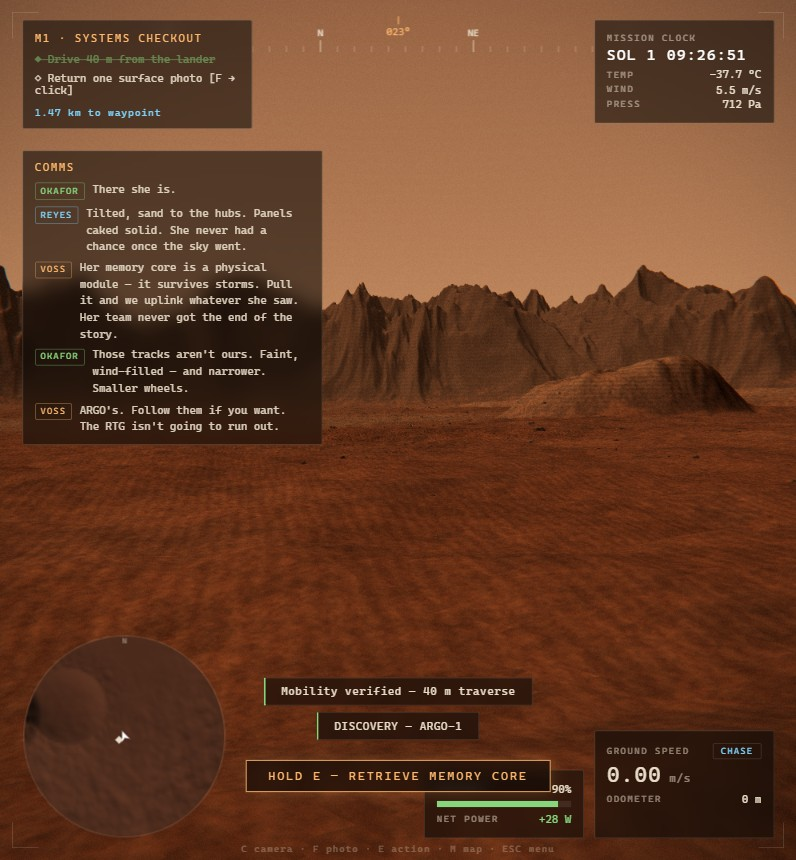
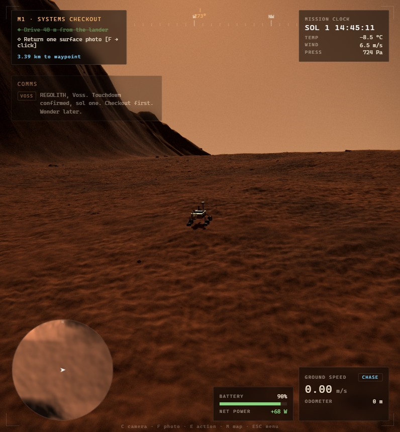
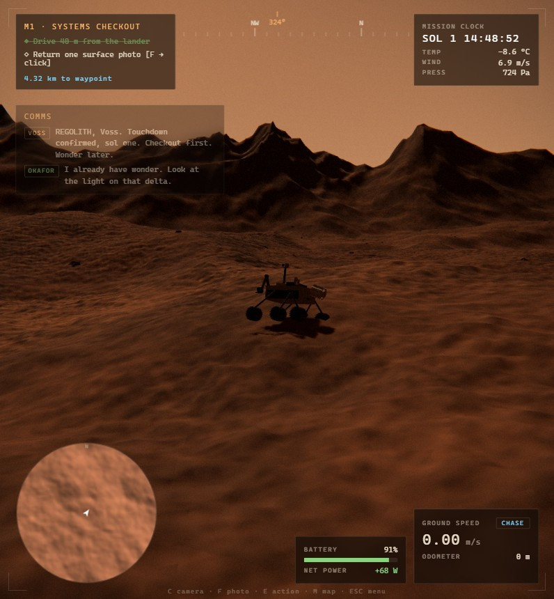

# REGOLITH — a Mars survey

A hyper-real 3D Mars rover survey sim that runs in a browser tab. Drive a
Perseverance-class rover across a 6 km sandbox — a crater modeled on Jezero, Perseverance's
real site, the inlet canyon breaching its western wall, and the plateau beyond — through an
eight-mission survey campaign on a real sol clock, with a story buried in the sand.

**▸ Play: https://regolith.alyoechosys.dev**


## What's in it

**The world.** A 6144 m heightfield built as Jezero-style geology rather than noise. In the
crater: a west-wall **river delta** whose front scarp exposes ~30 m of terraced strata
(Jezero's delta strata run ~25 m, with flood-carried boulders to 1.5 m — both are in the
game); a Kodiak-style remnant butte standing alone on the floor; a Séítah-style dune maze
with the floor's oldest rock outcropping between the ripples; a cracked playa; ~190 impact
craters; and the crater's own inner rim wall (Jezero's walls rise 800–1200 m). The wall is
breached on the west by an **inlet canyon** — a graded causeway that climbs 140 m from the
delta apex to a **plateau** of flat-topped mesas, the terraced shoreline of a second, higher
paleolake, a lava-tube skylight, and ridgelines continuing kilometers beyond. Rendered in
two tiers — a high-resolution shader-displaced tile riding under the rover over a tiled
full-world mesh — with an exactly matching JS sampler so the wheels feel every bump you can
see.


**The rover.** Rocker-bogie suspension articulating from six independent wheel contacts,
turn-in-place via splayed corner wheels, sand slip and grade loss, gold MLI and a finned
RTG, an arm that unfolds through real poses to drill, and a mast that physically aims where
the mast camera looks. Wheel tracks persist in the world — and dust storms slowly bury them.

**The atmosphere.** A real sol clock (one sol ≈ 24.7 real minutes), butterscotch days,
the genuine *blue* Martian sunset glow with twilight that lingers up to two hours the way
high-altitude dust really keeps it lit, stars with Phobos rising in the west, roaming dust
devils you can photograph, and regional dust storms announced by a falling barometer.
Temperatures swing −85 °C to −8 °C, and the RTG-plus-battery model makes night heater load
and steep climbs a real decision. Hold `T` to wait out the dark and recharge.

| | |
|---|---|
|  |  |
| Mastcam-Z catching two dust devils | Sunset — Mars scatters blue forward |
|  |  |
| Topographic map, click to set waypoints | PIXL/SHERLOC composite readout |

**The survey.** Eight missions: systems checkout, crater-rim spectrometry, dune-crest
sampling, coring the delta front, a rim-bench relay deploy, the climb up the inlet canyon to
the plateau, photographing an active dust devil, and a final high-gain uplink. Findings name
real Mars mineralogy. Progress saves locally.

**The story.** You are not the first rover here. ARGO-1 landed on the plateau beyond the
western rim years ago, drove down the inlet on its own extended mission, and went silent in
the sands when a global dust storm starved its solar arrays. Your survey finds it piece by
piece — the parachute and backshell on the crater floor, its faint wheel tracks still leading
into the dunes, the rover itself tilted in a sand trap — and offers a choice: spend arm time
and battery to pull its memory core, and its team's final uplinks come back one at a time,
sol by sol. Three named ops voices — a flight director, a geologist, a systems engineer —
react to everything you find, and the geology escalates from "nice clays" to something the
geologist won't say out loud on an open loop.



**The sandbox.** Beyond the spine: eighteen-odd discoveries off the map's edges — an iron
meteorite, a hematite-spherule field, a ventifact garden, a lava-tube skylight, shoreline
terraces from a second, higher lake, mesas, viewpoints, ARGO's landing platform and sample
cache, and one very rectangular rock. Ten sample tubes force choices about what goes home.
World events happen to you: a meteorite strike punches a fresh crater into the terrain and
you can go scan the ice it excavated, Phobos transits the sun for forty seconds, solar
conjunction cuts you off from Earth for a full sol (ARGO's logs keep you company), and a
global dust storm shuts the sky. The ending composes itself from what you actually did.

| | |
|---|---|
|  |  |
| Up the inlet canyon toward the plateau | The plateau: mesas and the old shoreline |

## Controls

| | |
|---|---|
| `W A S D` | drive — turns in place when stopped |
| `SPACE` / `SHIFT` | brake / precision mode |
| mouse, scroll | orbit camera, zoom |
| `C` | cycle camera — chase, orbit, mastcam, hazcam |
| `F` · `G`/click | photo mode · capture |
| `E` | contextual action — scan, drill, deploy, uplink |
| `M` · `L` · `T` | map · work lamps · hold to wait (×300 time) |
| `ESC` | pause, settings, uplink log |

## Development

```bash
npm install
npm run dev       # esbuild dev server on 127.0.0.1:8971
npm run build     # bundle + restamp cache-busting versions
npm run verify    # gates — must be green before committing
```

`public/dist/bundle.js` is committed deliberately (the deploy target runs no build step), so
**always `npm run build` before committing** — `npm run verify` fails loudly if the bundle
has drifted from `src/`, and `npm run verify:live` proves the deployed bytes match the repo.

Working on this? Read **[AGENTS.md](AGENTS.md)** first — module map, the invariants that
cause action-at-a-distance bugs when broken, and the traps already paid for.
[DESIGN.md](DESIGN.md) covers what the thing is and why it's built this way.

Stack: [three.js](https://threejs.org) r185 + [esbuild](https://esbuild.github.io). No
framework, no runtime dependencies, no external network calls — every mesh, texture and
sound effect is generated in code. The one exception: five ambient music beds (title, day,
night, dust storm, and ARGO's ghost theme) — four generated with MiniMax music-2.6, the
fifth with Suno via [sunoapi.org](https://sunoapi.org) (`tools/suno.mjs`; MiniMax's music
API has since been withdrawn) — crossfaded by context in-game. Music has its own volume
slider in the pause menu.
