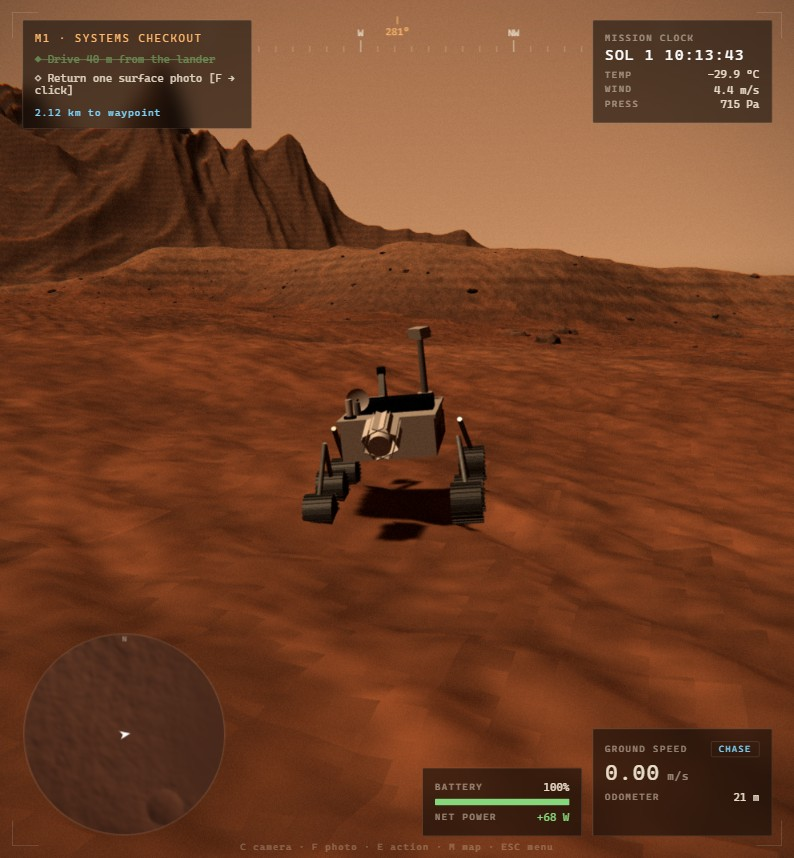
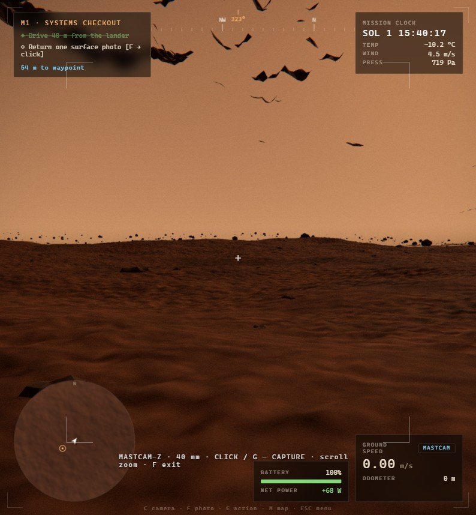
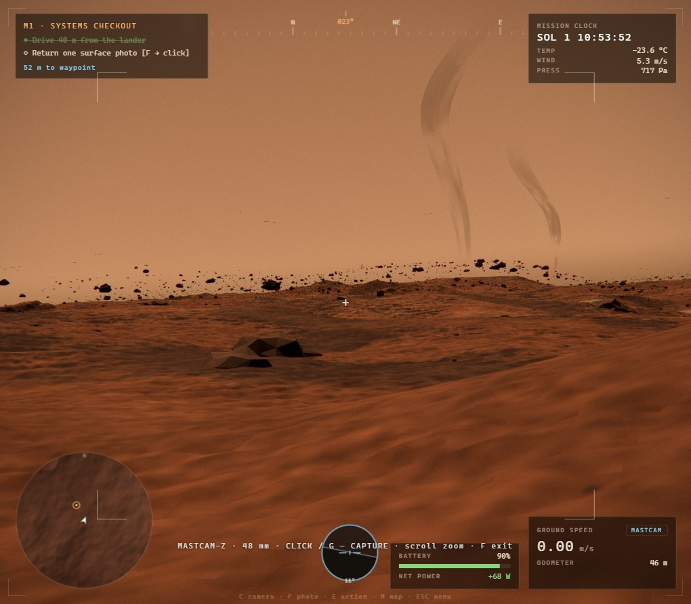
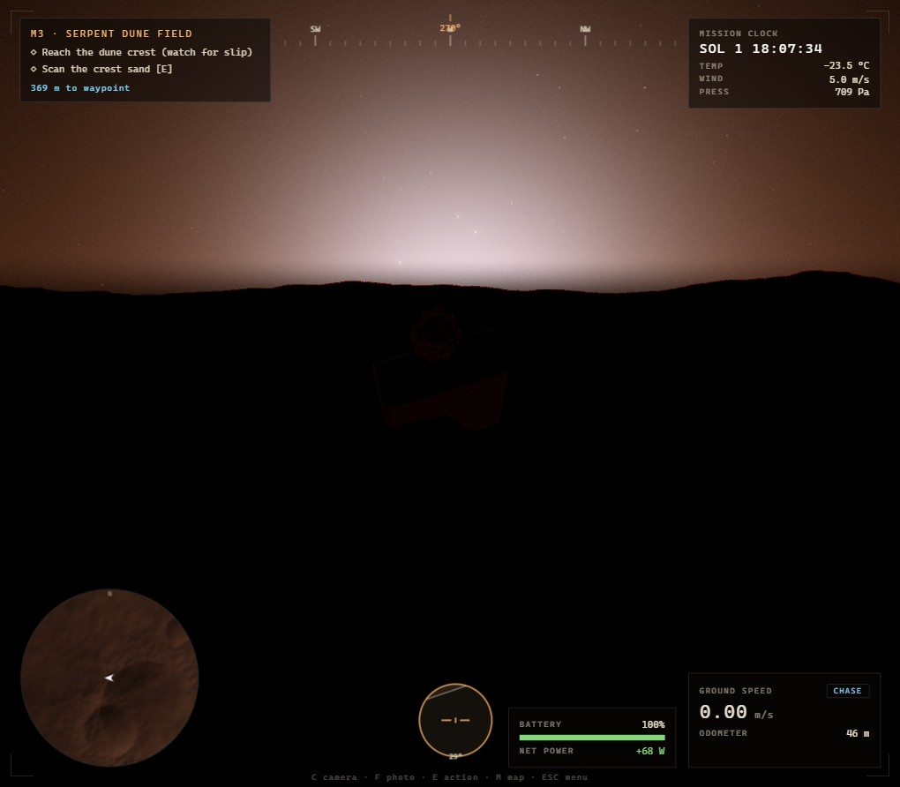
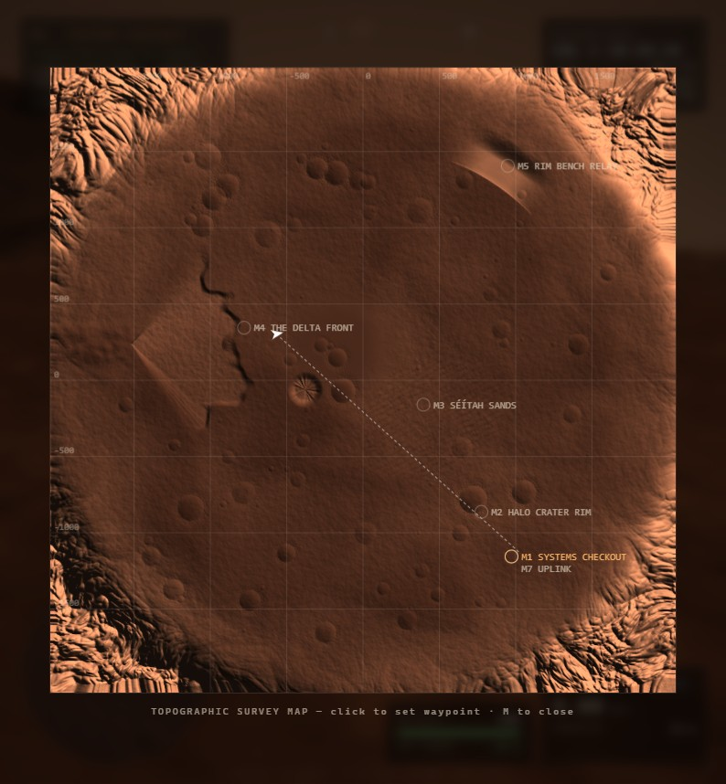
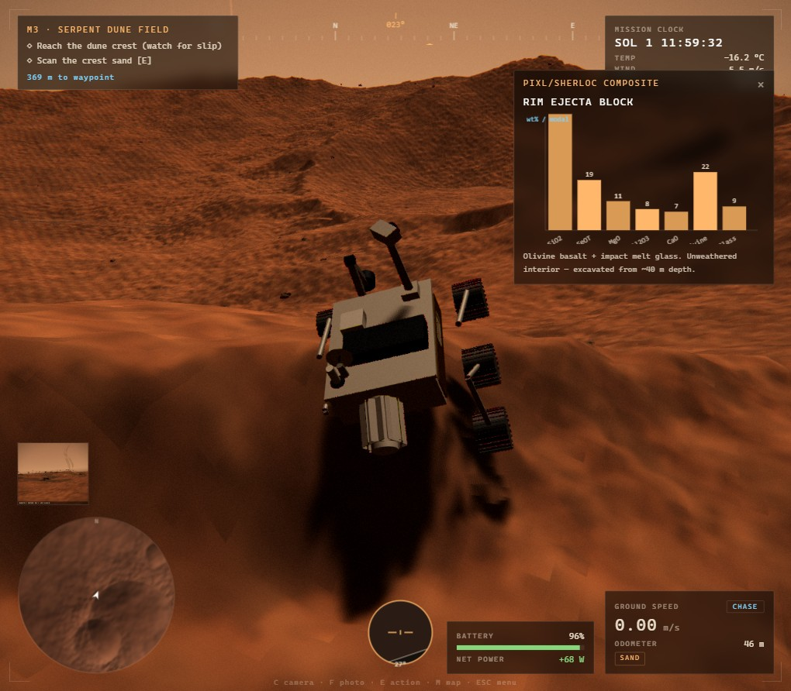

# REGOLITH — a Mars survey

A hyper-real 3D Mars rover survey sim that runs in a browser tab. Drive a
Perseverance-class rover across a 4 km quad set on the floor of a large impact crater —
modeled on Jezero, Perseverance's real site — through a seven-mission survey campaign on
a real sol clock.

**▸ Play: https://regolith.alyoechosys.dev**



## What's in it

**The world.** A 4096 m heightfield built as Jezero-style geology rather than noise: a
west-wall **river delta** whose front scarp exposes ~30 m of terraced strata (Jezero's
delta strata run ~25 m, with flood-carried boulders to 1.5 m — both are in the game), fed
by a channel cut through the crater wall; a Kodiak-style remnant butte standing alone on
the floor; a Séítah-style dune maze with the floor's oldest rock outcropping between the
ripples; a cracked playa; ~120 impact craters; and the crater's own inner rim wall as the
world edge, its silhouette continuing to ridgelines kilometers beyond (Jezero's walls
rise 800–1200 m). Rendered in two tiers — a high-resolution shader-displaced tile riding
under the rover over a tiled full-world mesh — with an exactly matching JS sampler so the
wheels feel every bump you can see.



**The rover.** Rocker-bogie suspension articulating from six independent wheel contacts,
turn-in-place via splayed corner wheels, sand slip and grade loss, gold MLI and a finned
RTG, an arm that unfolds through real poses to drill, and a mast that physically aims where
the mast camera looks. Wheel tracks persist in the world — and dust storms slowly bury them.

**The atmosphere.** A real sol clock (one sol ≈ 24.7 real minutes), butterscotch days,
the genuine *blue* Martian sunset glow with twilight that lingers up to two hours the way
high-altitude dust really keeps it lit, stars with Phobos rising in the west, roaming dust
devils you can photograph, and regional dust storms announced by a falling barometer.
Temperatures swing −85 °C to −8 °C, and the RTG-plus-battery model makes night heater load
and steep climbs a real decision. Hold `T` to wait out the dark and recharge.

| | |
|---|---|
|  |  |
| Mastcam-Z catching two dust devils | Sunset — Mars scatters blue forward |
|  |  |
| Topographic map, click to set waypoints | PIXL/SHERLOC composite readout |

**The survey.** Seven missions: systems checkout, crater-rim spectrometry, dune-crest
sampling, lakebed coring, a summit relay deploy, photographing an active dust devil, and a
final high-gain uplink. Findings name real Mars mineralogy. Progress saves locally.

## Controls

| | |
|---|---|
| `W A S D` | drive — turns in place when stopped |
| `SPACE` / `SHIFT` | brake / precision mode |
| mouse, scroll | orbit camera, zoom |
| `C` | cycle camera — chase, orbit, mastcam, hazcam |
| `F` · `G`/click | photo mode · capture |
| `E` | contextual action — scan, drill, deploy, uplink |
| `M` · `L` · `T` | map · work lamps · hold to wait (×300 time) |
| `ESC` | pause, settings, uplink log |

## Development

```bash
npm install
npm run dev       # esbuild dev server on 127.0.0.1:8971
npm run build     # bundle + restamp cache-busting versions
npm run verify    # gates — must be green before committing
```

`public/dist/bundle.js` is committed deliberately (the deploy target runs no build step), so
**always `npm run build` before committing** — `npm run verify` fails loudly if the bundle
has drifted from `src/`, and `npm run verify:live` proves the deployed bytes match the repo.

Working on this? Read **[AGENTS.md](AGENTS.md)** first — module map, the invariants that
cause action-at-a-distance bugs when broken, and the traps already paid for.
[DESIGN.md](DESIGN.md) covers what the thing is and why it's built this way.

Stack: [three.js](https://threejs.org) r185 + [esbuild](https://esbuild.github.io). No
framework, no runtime dependencies, no external network calls — every mesh, texture and
sound effect is generated in code. The one exception: four ambient music beds (title, day,
night, dust storm) generated with MiniMax music-2.6 and crossfaded by context in-game.
Music has its own volume slider in the pause menu.
